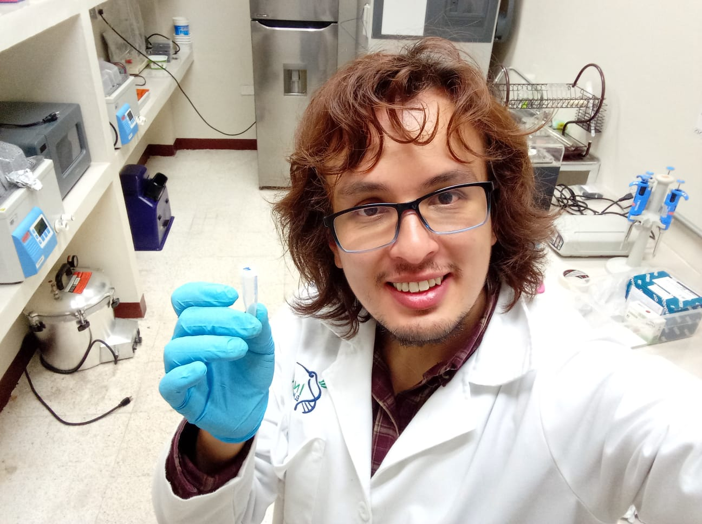

# Luis Rodrigo Arce Valdés

<a href="mailto:bio.l.rodrigo.arce@gmail.com" title="click to email">bio.l.rodrigo.arce@gmail.com</a> 

<a href="https://www.researchgate.net/profile/Luis_Rodrigo_Arce-Valdes">ResearchGate</a> 

<a href="https://scholar.google.com/citations?user==Td0GFt0AAAAJ&hl=en&scioq=luis+rodrigo+arce-vald%C3%A9s&user=Td0GFt0AAAAJ">Google Scholar</a> 

<a href="https://orcid.org/0000-0001-6445-7534">ORCiD</a> 

<a href="https://github.com/LuisRodrigoArce-Valdes">GitHub</a> 

<a>+52 722-54-56-950</a>

## Education

### Academic Trajectory

`2019 -`
**Instituto de Ecología A.C.** México. PhD Candidate. Supervisor: Rosa Ana Sánchez Guillén. Thesis: The evolution of reproductive isolation in sympatric insect populations with emphasis on a damselfly hybrid zone.

`2016 - 2018`
**Centro de Investigación Científica y de Educación Superior de Ensenada**. M. S. Environmental Biology. Co-Supervisors: Alicia Abadía Cardoso & María Clara Arteaga Uribe. Thesis: [Estado de conservación e historia demográfica de *Cynoscion othonopterus* a través de la estimación de su tamaño efectivo poblacional.](https://cicese.repositorioinstitucional.mx/jspui/bitstream/1007/2509/1/tesis_Arce%20Vald%c3%a9s_Luis%20Rodrigo_05_oct_2018.pdf)

`2011 - 2015`
**Universidad Autónoma del Estado de México**. B. S. Biology.

`2008-2011`
**The International Baccalaureate (IB)**. The IB Diploma.

### Courses & Workshops

`2021`
**Nodo Nacional de Bioinformática UNAM & Comunidad de Desarrolladores de Software en Bioinformática**. Assembly and Annotation of Genomes and Metagenomes .

`2020`
**Physalia-courses & the Free University of Berlin**. Adaptation Genomics. 

`2018`
**American Fisheries Society**. A Life Cycle of Scientific Communication: Presenting, Writing, Reviewing, and Using Social Media for a Variety of Audiences.

## Experience

### Research Assistance

`2020 - `
**Instituto de Ecología A. C.** Host: Mario Enrique Favila Castillo. Molecular systematics of *Canthon cyanellus* using microsatellites.

### Visits

`2018`
**University of California Santa Cruz - NOAA Southwest Fisheries Science Center**. Host: John Carlos Garza. Technological innovations for the conservation and reproduction of marine fish species with emphasis on Totoaba (*Totoaba macdonaldi*).

`2015`
**Universidad Autónoma de Baja California**. Host: Luis Manuel Enríquez-Paredes. Totoaba (*Totoaba macdonaldi*) genetic traceability in captivity and in the wild population.

`2014`
**Universidad Autónoma del Estado de Hidalgo**. Host: Pablo Octavio Aguilar. Genetic flow between *Dichromanthus aurantiacus* patches in El Chico national park, Hidalgo.

### Peer reviewing

`2023`
[**Ciencia y Tecnología Agropecuaria**](https://revistacta.agrosavia.co/index.php/revista)

## Scientific Publications

### Peer Reviewed Articles

`Under Review`
Arce-Valdés, L. R., Ballén-Guapacha, A. V., Rivas-Torres, A., Chávez-Ríos, J. R., Wellenreuther, M., Hansson, B. & Sánchez-Guillén, R. A. Testing the predictions of reinforcement: long-term empirical data from a damselfly mosaic hybrid zone. **Evolution**.

Sánchez-Guillén, R. A., Arce-Valdés, L. R., Swaegers, J., Chauhan, P., Chávez-Rios, J. R., Rivas-Torres, A., Wellenreuther, M. & Hansson, B. [Variable genomic patterns of hybridization in an expanding hybrid zone of damselflies](https://www.authorea.com/doi/full/10.22541/au.164628976.68855627). **Molecular Ecology**. [10.22541/au.164628976.68855627/v1](https://www.authorea.com/doi/full/10.22541/au.164628976.68855627)

`In Press`
Sánchez-Guillén, R. A., Arce-Valdés, L. R., Ballén-Guapacha, A. V., Ordaz-Morales, J. & Stand-Pérez M. (2023). Interspecific hybridization in insects in times of climate change. Accepted book chapter in: Effects of climate change on insects, **Oxford University Press**.

`2023`
Arce-Valdés, L. R., Abadía-Cardoso, A., Arteaga, M. C., Peñaranda-Gonzalez, L. V., Ruiz-Campos, G. & Enríquez-Paredes, L. M. (2023). [No effects of fishery collpase on the genetic diversity of the Gulf of California Corvina, *Cynoscion othonopterus* (Perciformes: Sciaenidae)](https://www.researchgate.net/publication/367117217_No_effects_of_fishery_collapse_on_the_genetic_diversity_of_the_Gulf_of_California_Corvina_Cynoscion_othonopterus_Perciformes_Sciaenidae). **Fisheries Research**, 261, 106608. [https://doi.org/10.1016/j.fishres.2023.106608](https://doi.org/10.1016/j.fishres.2023.106608)

`2022`
Armada-Tapia, S., Castillo-Geniz, J. L., Victoria-Cota, N., Arce-Valdés, L. R. & Enríquez-Paredes, L. M. (2022). [First evidence of multiple paternity in the blue shark (*Prionace glauca*)](https://www.researchgate.net/publication/365598572_First_evidence_of_multiple_paternity_in_the_blue_shark_Prionace_glauca). **Journal of Fish Biology**, 102(2), 528-531. [https://doi.org/10.1111/jfb.15272](https://doi.org/10.1111/jfb.15272)

Arce-Valdés, L. R. & Sánchez-Guillén, R. A. (2022). [The evolutionary outcomes of climate-change-induced hybridization in insect populations](https://www.researchgate.net/publication/363407075_The_evolutionary_outcomes_of_climate_change-induced_hybridization_in_insect_populations). **Current Opinion in Insect Science**, 54, 100966. [https://doi.org/10.1016/j.cois.2022.100966](https://doi.org/10.1016/j.cois.2022.100966)

`2021`
Arce-Valdés, L. R., Sánchez-Guillén, R. A., Nolasco-Soto, J., & Favila, M. E. (2021). [Next-generation sequencing, isolation and characterization of 14 microsatellite loci of *Canthon cyanellus* (Coleoptera: Scarabaeidae)](https://www.researchgate.net/publication/355200942_Next-generation_sequencing_isolation_and_characterization_of_14_microsatellite_loci_of_Canthon_cyanellus_Coleoptera_Scarabaeidae). **Molecular Biology Reports**, 48(11), 7433–7441. [https://doi.org/10.1007/s11033-021-06761-8](https://link.springer.com/article/10.1007%2Fs11033-021-06761-8)

### Presentations

`2022`
Arce-Valdés, L. R. & Sánchez-Guillén, R. A. (2022). The evolutionary outcomes of climate-change-induced hybridization in insects: testing predictions. **Climate change genomics: vulnerabilities, adaptations and applications**. British Ecological Society.

`2020`
Soto-González, M. E., Arce-Valdés, L. R. & Enríquez-Paredes, L. M. (2020). Genetic assessment on the conservation status of the Gulf Corvina in the face of the U.S. embargo to all gill-net fisheries in the Upper Gulf of California. **Virtual Annual Meeting of the American Fisheries Society 2020**.

`2018`
Arce-Valdés, L. R., Arteaga-Uribe, M. C., Abadía-Cardoso, A. & Enríquez-Paredes, L. M. (2018). Genetic Diversity and Effective Population Size of the Gulf Corvina (*Cynoscion othonopterus*) Highlights Its Vulnerable Conservation Status. **148th Annual Meeting of the American Fisheries Society**.

`2014`
Arce-Valdés, L. R., Islas-Tello, L. A. & Octavio-Aguilar, P. (2014). Flujo génico entre manchones poblacionales de *Dichromanthus aurantiacus* en el parque nacional El Chico, Hidalgo. **Congreso Nacional del XIX Verano de la Investigación Científica y Tecnológica del Pacífico**.

### Posters

`2021`
Arce-Valdés, L. R., Ballén-Guapacha, A. V. & Sánchez-Guillén, R. A. (2021). [Reforzamiento rápido del aislamiento reproductivo precigótico en una región híbrida de caballitos del diablo](https://www.researchgate.net/publication/356760169_Reforzamiento_rapido_del_aislamiento_reproductivo_precigotico_en_una_region_hibrida_de_caballitos_del_diablo). **1er Congreso Latinoamericano de Evolución. CLEVOL**

Sánchez-Guillén, R. A., Arce-Valdés, L. R., Swaegers, J., Wellenreuther, M. & Hansson, B. (2021). [Testing the consistency of hybridization outcomes between two damselflies in Spain](https://www.researchgate.net/publication/355335502_Testing_the_consistency_of_hybridization_outcomes_between_two_damselflies_in_Spain). **Student Conference on Conservation Science**. Center for Biodiversity and Conservation, American Museum of Natural History.

`2019`
Soto-González, M. E., Arce-Valdés, L. R. & Enríquez-Paredes, L. M. (2019). [Low mitochondrial genetic diversity in the Gulf Corvina and its implications on fishery management](https://www.researchgate.net/publication/337655970_Low_mitochondrial_genetic_diversity_in_the_Gulf_Corvina_and_its_implications_on_fishery_management). **100th Annual Western Society of Naturalists Meeting**.

## Supervised theses

### Master's theses

`2021`
Soto-González, E. M. (2021). [Diversidad genética mitocondrial de la curvina golfina y sus implicaciones en el manejo de la pesquería](https://drive.google.com/file/d/1WXPKwFcyXmlbx5USYxDVatAzw6a_wHb3/view). M. S. Coastal Oceanography. **Universidad Autónoma de Baja California**.

## Teaching

### Graduate courses

`2022`
**Instituto de Ecología A. C.** M.S. & PhD. Speciation and Evolutionary Consequences of the Hybridization.

`2020`
**Universidad Autónoma de Baja California**. M. S. Coastal Ocenography. Directed Research: Bioinformatic tools for population analyses using mitochondrial haplotypes.

### Undergraduate courses

`2018`
**Universidad Autónoma de Baja California**. B. S. Biotechnology in aquaculture. Aquaculture Genetics.

### High school courses

`2016`
**Academia Mexicana de Ciencias**. XXV National Biology Olympics. Genetics.

`2015`
**Academia Mexicana de Ciencias**. XXIV National Biology Olympics. Virus and Bacteria.

## Scholarships and Funding

### Scholarships

`2019 - `
**Consejo Nacional de Ciencia y Tecnología**. CONACyT national graduate studies scholarship. PhD scholarship.

`2016 - 2018`
**Consejo Nacional de Ciencia y Tecnología**. CONACyT national graduate studies scholarship. Masters scholarship.

### Grants

`2015`
**Academia Mexicana de Ciencias**. Travel grant. 25th Summer of Scientific Research of the Academia Mexicana de Ciencias A.C. 

`2014`
**Academia Mexicana de Ciencias**. Travel grant. 24th Summer of Scientific Research of the Academia Mexicana de Ciencias A.C. 

## Science Communication

### Articles

`2022`
Stand-Pérez, M. A., Aguirre-Pérez, I. A., Arce-Valdés, L. R., Ayala-Sánchez, D., Ballén-Guapacha, A. V., Ordaz-Morales, J. E., Pulido-Ríos, L., Ríos-Olaya, K. J. & Sánchez-Guillén, R. A. (2022). [Hibridación: como estudiar la evolución a través de la reproducción](https://www.cronica.com.mx/academia/hibridacion-estudiar-evolucion-traves-reproduccion.html?fbclid=IwAR22iZrb8b0_4xBO_sRG-TJPZ-iXQm7RcGZGDUP8EYIKPw2Op9cEA9nj9qs). **CRÓNICA**.

`2021`
Arce-Valdés, L. R., Sánchez-Guillén, R. A., Nolasco-Soto, J., & Favila, M. E. (2021). [Microsatélites: secretos evolutivos del ADN](https://elportal.mx/princ/microsatelites-secretos-evolutivos-del-adn/). **Portal. Comunicación Veracruzana**.

`2019`
Arce-Valdés, L. R. & Enríquez-Paredes, L. M. (2019) [Monitoreo de la diversidad genética como indicador de la sustentabilidad pesquera de la curvina golfina](http://www.educacionbc.edu.mx/departamentos/investigacion/publicaciones/espirituaccion/Archivos/29/REVISTA%20ECA%20No%2029%20WEB%20Septiembre%206%202pm.pdf). **Espíritu Científico en Acción**. 15 (29): 3-13.

### Other

`2022-`
Memeber of the scientific communication committee of the [**Red Mexicana de Biología Evolutiva**](https://mexevol.com/).

`2020`
Ballén-Guapacha, A. V., Sánchez-Guillén, R. A., Nolasco-Soto, J., Arce-Valdés, L. R., Ordaz-Morales, J. E. & Stand-Pérez, M. A. (2020) [Conociendo a las libélulas](https://www.youtube.com/watch?v=CkjWeTuxL1Q). **Instituto de Ecología, A. C.**.

## Awards

`2021`
**American Museum of Natural History**. Student Conference on Conservation Science. Best Poster: Best Use of Quantitative Methods in Conservation Research: Testing the consistency of hybridization outcomes between two damselflies in Spain.

`2011` 
**Microsoft**. Worldwide Competition on Microsoft Office (Microsoft Office Excel 2007), San Diego 2011. 3rd place in Mexico's national competition.

**Microsoft**. Worldwide Competition on Microsoft Office (Microsoft Office Excel 2007), San Diego 2011. 1st place in the State of Mexico state competition.
 
`2010`
**Microsoft**. Worldwide Competition on Microsoft Office (Microsoft Office Word 2007), Utah 2010. 2nd place in the State of Mexico state competition.

**Banco de México**.Prize Contact Banxico. 1st National Place.

**Universidad Iberoamericana**. 6° National Contest on pre-university assay: Contemporary ethical dilemmas. Honorific mention.

**Universidad Autónoma del Estado de México**. XX Biology Olympics of the State of Mexico. 2nd place.

`2009` 
**Universidad Autónoma del Estado de México**. XIX Biology Olympics of the State of Mexico. 1st place.

## Memberships

**Red Mexicana de Biología Evolutiva**. Science communication committee.

**Fauna & Flora International - Oryx**. 5759530.

**Red Mexicana de Bioinformática**.  ARVL000590.

**Society for the Study of Evolution**. 

<!-- ### Footer

Last Update: February 2023 -->
